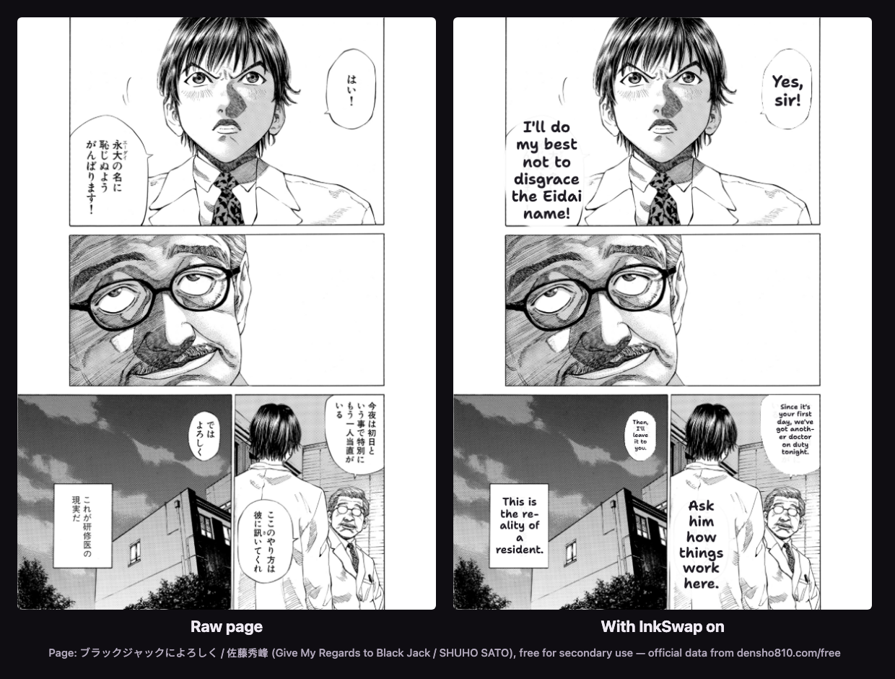

<p align="center"></p>

# InkSwap

A Chrome extension that translates raw manga where you read it, bubble by bubble, by meaning instead of word for word.

Switch it on for a tab and each speech bubble is covered with a hand-lettered translation that fits its exact shape. Lines read the way a fluent speaker would say them: "How did you get into my house?", not "How did you get the other way?". It keeps going as you scroll and into the next chapter, until you switch it off.

It's a proof of concept, built for the Devpost hackathon *Build With AI: Basics* and tested on [MangaDex](https://mangadex.org) and [Shonen Jump+](https://shonenjumpplus.com).



<sub>A real InkSwap run. Page from <i>ブラックジャックによろしく</i> (<i>Give My Regards to Black Jack</i>) by 佐藤秀峰 (Shuho Sato), which the author has made free for secondary use; taken from the <a href="https://densho810.com/free/">official free data</a>.</sub>

## What it does

- **Translates by meaning.** Each page goes to Claude (Sonnet 5.5), which keeps the speaker's tone, honorifics such as *-kun* and *-senpai*, and characters' names.
- **Covers each bubble exactly.** InkSwap finds the bubbles on the page itself and numbers them, so Claude only has to say which line belongs in which bubble. Each translation is painted in that bubble's exact shape and sized to fit. Touching bubbles are split, so each line gets its own.
- **Leaves some text alone:** bubbles already in your language, bubbles it can't read clearly, and sound effects.
- **Works per tab and stays on across chapters.** Turn it on from the popup or by right-clicking the page and choosing **Translate this page**.
- **Shows what's happening.** Pages show a spinner while they translate. The first translated page plays a chime with a "Page translated" toast, and each later chapter gets one "Chapter translated" toast. If a page fails, it stays as it was, with a **↻ Retry** button.
- **Remembers what it has translated.** Pages you've already translated in this browser come back instantly and free when you return, reload or restart Chrome. If your connection drops while a chapter is open, those pages still show their translations. Only the translations are saved, never the manga pages, and **Clear saved translations** in the popup forgets them.
- **Lets you set it up your way.** Choose English, Spanish or French, set how opaque the bubbles are (this updates live), and switch the chime and toasts on or off.

## Try it

You need Chrome, [Node.js](https://nodejs.org) 20 or newer, and a Claude API key from the [Claude Console](https://console.anthropic.com).

1. Build the extension:
   ```sh
   npm install
   npm run build
   ```
2. In Chrome, open `chrome://extensions`, turn on **Developer mode** (top right), click **Load unpacked**, and choose the `.output/chrome-mv3` folder.
3. Click the InkSwap icon in the toolbar (pin it from the puzzle-piece menu if you don't see it). Paste your Claude API key and click **Save**.
4. Open a raw (untranslated) chapter on MangaDex or Shonen Jump+. Flip **Off for this tab** on, or right-click the page and choose **Translate this page**.
5. Read. Pages translate as they come into view. On Shonen Jump+, turn pages with ←.

To translate into Spanish or French, pick the language in the popup. The chapter you're reading is translated again in the new language.

### Your key and what it costs

InkSwap uses **your own** Claude API key, and you pay Anthropic for what you translate. In testing, a page cost about **1–3¢** and took **5–10 seconds**. Full-resolution MangaDex pages are at the higher end, so a 40-page chapter costs roughly 40¢–$1.20. InkSwap sends at most 2 pages at a time per tab, only translates in tabs you've switched on, and rereading a page you've already translated (in the same language) costs nothing.

Your key is stored only in this browser (`chrome.storage.local`), and only InkSwap's background worker reads it. Page images go to Anthropic's API to be translated; InkSwap doesn't store or share them anywhere else.

## Known limits

- It has only been tested on MangaDex and Shonen Jump+. Other sites may not be detected.
- Narration that floats on the artwork, outside any bubble, uses Claude's own estimate of where the text is, which can be slightly off. Text inside speech bubbles and caption boxes is placed exactly.
- Shonen Jump+ protects its page images, so InkSwap translates what's on screen. It can't translate pages ahead of where you are.
- Saved translations need the manga page itself to load, so you can't open a chapter from scratch with no internet. They keep the most recently read ~2,000 pages.

## How it works

```
popup ──switch on──▶ background worker ◀──page picture── page helper (on the manga site)
                       │  finds bubbles, numbers them,          │
                       │  asks Claude (one call per page)       │
                       └──────── translated bubbles ───────────▶ draws them in a shadow root
```

- `entrypoints/content/` is the page helper. It finds manga pages, captures each page's picture (read directly, or a screenshot crop when the site blocks that), and draws the overlay.
- `entrypoints/background.ts` is the background worker. It tracks which tabs are on, runs the right-click menu, limits Claude calls per tab, and decides when to chime and show toasts.
- `lib/bubbles.ts` finds bubbles: each bubble's inside is a closed white shape with the letters as holes in it.
- `lib/fingerprint.ts` and `lib/cache.ts` recognise a page you've already translated and keep its translation.
- `lib/translate.ts` makes the Claude call and checks the JSON that comes back. `lib/prompt.ts` is the translation prompt.
- `lib/overlay.ts` and `assets/overlay.css` draw the labels, the spinner, the toasts, and the Retry pill.
- `entrypoints/popup/` is the popup. `entrypoints/offscreen/` is a hidden page that plays the chime.

Built with [WXT](https://wxt.dev), TypeScript, the [Anthropic TypeScript SDK](https://github.com/anthropics/anthropic-sdk-typescript), and [zod](https://zod.dev).

## Development

```sh
npm run dev      # opens Chrome with InkSwap loaded; reloads as you edit
npm test         # unit tests (box math, text fitting, bubble finding, the call limiter, page fingerprints, saved translations)
npm run compile  # type check
node scripts/render-icons.mjs  # re-render public/icon*/ PNGs from assets/icon*.svg
```

The end-to-end checks load the built extension into Playwright's Chromium and use real pages and real Claude calls, so they cost a little. Put your key in a git-ignored `.env` file as `ANTHROPIC_API_KEY=…`, run `npm run build`, then:

```sh
node --env-file=.env scripts/try-extension.mjs <chapter-url> [outDir]   # translate one page, save screenshots
node --env-file=.env scripts/check-reading.mjs                          # whole chapters, next chapter, 2-call limit, switching off
PW_EXPERIMENTAL_SERVICE_WORKER_NETWORK_EVENTS=1 \
  node --env-file=.env scripts/check-feedback.mjs                       # chime, toasts, failures and Retry
node --env-file=.env scripts/check-settings.mjs                         # popup, opacity, Spanish, settings after a restart
node --env-file=.env scripts/check-sjplus.mjs                           # the journey on Shonen Jump+
node --env-file=.env scripts/check-longstrip.mjs                        # MangaDex long-strip, Spanish → English, leaving the tab
PW_EXPERIMENTAL_SERVICE_WORKER_NETWORK_EVENTS=1 \
  node --env-file=.env scripts/check-saved.mjs                          # saved translations: reload, offline, restart, Clear
node --env-file=.env scripts/make-readme-shot.mjs --page <page.png> --credit "<title / author>"
                                                                        # re-make docs/translation-before-after.png
```

Only use a page you're allowed to republish, since the image goes in this public README. Without `--page`, the script draws an original sample comic instead.

The first time, run `npx playwright install chromium` to download Playwright's browser.

## Credits

The manga page in the screenshot is from *ブラックジャックによろしく* / 佐藤秀峰 (*Give My Regards to Black Jack* / SHUHO SATO), used under the author's free secondary-use terms ([details and data](https://densho810.com/free/)).

The fonts [Shantell Sans](https://fonts.google.com/specimen/Shantell+Sans) (bubble and popup text) and [Bangers](https://fonts.google.com/specimen/Bangers) (wordmark) are bundled under the SIL Open Font License. The licenses are in `public/fonts/`.

## License

The InkSwap code is released under the [MIT License](LICENSE). The bundled fonts and the screenshot's manga page keep their own terms, listed under Credits above.
